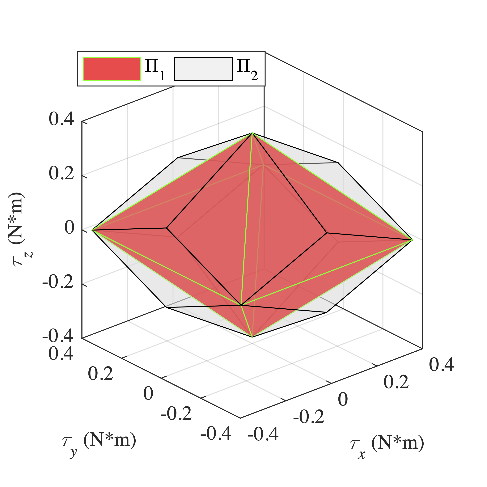

## About
This is a repos. for test new control allocation algorithm developed from [ simulation of the book "aircraft control allocation"](https://github.com/mengchaoheng/aircraft-control-allocation) and [qcat](https://github.com/mengchaoheng/qcat).

The new algorithm will used by a ductedfan UAV. The structure of a modern flight control system is as shown below

The function of control allocation is to return a control effector command that satisfies the constraints for a point in the moment space. Due to the presence of constraints, only limited moments are attainable.

This project will take the control allocation problem of ducted fan UAV as an example to test several currently known control allocation open source libraries. Several open source linear programming solvers have also been introduced, aiming to develop more efficient allocators for application in real aircraft. A new control allocation algorithm was also developed, which is based on modifications of existing methods. In order to be compatible with existing libraries, this project uses matlab and C/C++ programming languages. Matlab is used for testing and analysis. What is really used for aircraft is the C++ version of the function. For this purpose, We wrote test codes in two languages respectively.

## File structure 

- `control_allocation_lib`: some open source allocation lib, be used as submodules.
  - aircraft-control-allocation-book-simulation
  - qcat
- `function_lib`: some function used in the project.
- `handle_fly_log`: some ulg files of px4.
  - `xx_xx_xx.ulg`：flight log data.
- `LP_allocator`: LP-based control allocator obtained by modifying the existing control allocation library.
- `LP_lib`: some open source LP solver lib.
- `PCA`: prioritized control allocation (PCA) algorithm.
- `QP_allocator`: QP-based control allocator obtained by modifying the existing control allocation library.
- `reformula_LP`: The control allocation problem is reformulated into the standard form of the LP problem, and then a control allocator is designed based on the open source LP library.
- `Generate_input_data.m`: use flight data and some unit vector to generate the input data for test allocator. 
- `plot_fly_log_states.m`: use the ulg files of px4 to get flight data.
- `test.m`: test the allocator.
- `test_xxx.m`: some test for other purpose.
- `ac.slx` and `twin.slx`: simulink test.

## Instructions

For matlab usage:
1. Run `plot_fly_log_states.m` to get the `handle_fly_log/flight.mat` file.

2. Run `Generate_input_data.m` t get input data.

3. Run `test.m` or `test_xxx.m` file to test the allocator and plot some figure.

For C/C++ project:
1. ToDo: 
