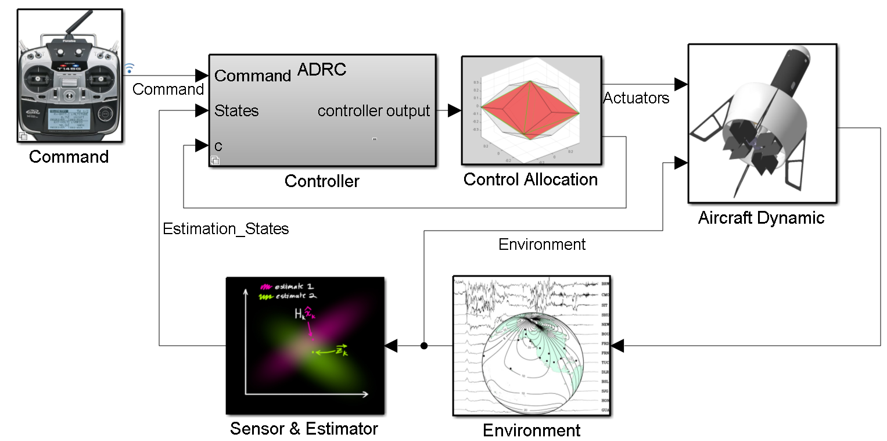
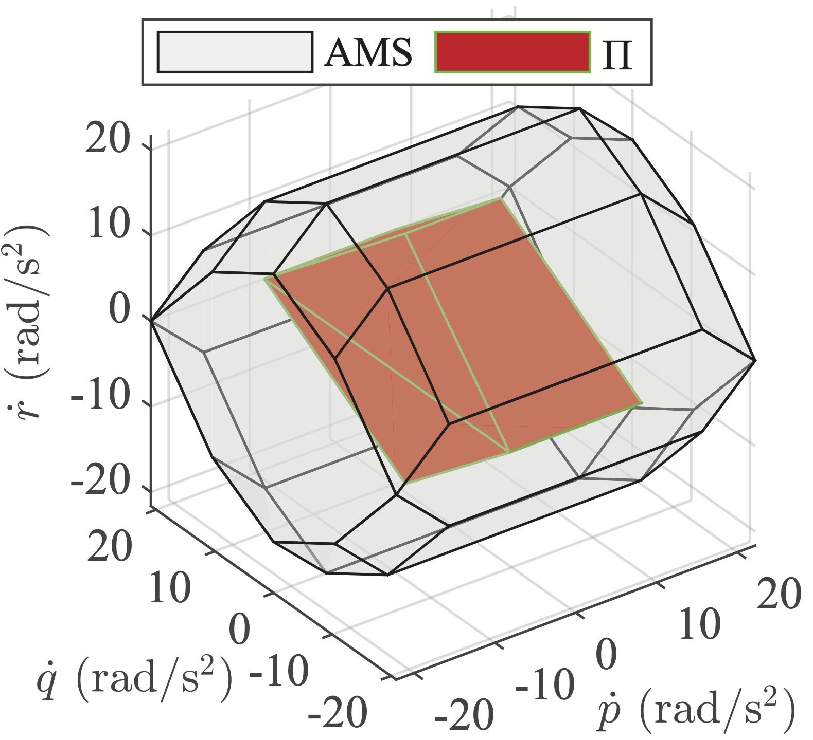

## About
This repository is designed for testing a new control allocation algorithm. The algorithm is developed based on simulations from the book ["aircraft control allocation"](https://github.com/mengchaoheng/aircraft-control-allocation) and the [QCAT](https://github.com/mengchaoheng/qcat) project


The new algorithm will be used in ducted fan UAVs, but it is not limited to this application. It can be applied to any over-actuated aircraft design.. The structure of a modern flight control system is as shown below



The function of control allocation is to generate control effector commands that satisfy constraints within a given moment space. Because of these constraints, only a limited set of moments can be achieved.



This project uses the control allocation problem of ducted fan UAVs as an example to test several well-known open-source control allocation libraries. Several open source linear programming solvers have also been introduced, aiming to develop more efficient allocators for application in real aircraft. A new control allocation algorithm was also developed, which is based on modifications of existing methods. In order to be compatible with existing libraries, this project uses matlab and C/C++ programming languages. Matlab is used for testing and analysis. What is really used for aircraft is the C++ version of the function. For this purpose, We wrote test codes in two languages respectively.


## Instructions

### For matlab usage:
1. Run `plot_fly_log_states.m` to get the `handle_fly_log/flight.mat` file.

2. Run `Generate_input_data.m` t get input data `input.csv`.

3. Run `test.m` or `test_xxx.m` file to test the allocator and plot some figure.

ToDo: fix the bug of `LP_lib/linear-programming-using-MATLAB`.

If you want to test the differences and similarities between the C++ version and MATLAB's code output, you can compile and run the target `main` of the `alloc_cpp` project. Then the data will be recorded into the `output.csv` file. Finally, execute `test.m` to compare (you need to modify the contents of the plot).

### For C/C++ project:
This repository implements the control allocation algorithm based on various mathematical operation libraries. The points 1, 2, 3, and 4 below are not steps but rather ways of using each code implementation.

1. For `alloc_cpp`: see readme in the folder.

```sh
cd build
cmake ..
make && ./main ## or other target: matlab_code_gen_LPwrap_test, Eingen_based_simplex, alglib_based_minlp_basic.
```
and then you can run `test.m` to compare the output of different implement of the algorithm.

2. For `LP_lib/alglib_demo`: Run
```Console
$ cd build
```
cd to build folder and run 
```Console
$ g++ -I ../src/alglib-cpp/src/ -o LPWrap_test.out  ../src/LPwrap/*.cpp ../src/LPwrap/*.c ../src/alglib-cpp/src/*.cpp -w  -O3

$ ./LPWrap_test.out
```
For test alglib-based vs `allocator_dir_LPwrap_4` dir allocator. we can see that running time of the allocator. alglib-based is 1.1416e-05s and `allocator_dir_LPwrap_4` is 3.75e-07s. after get the output.csv data file, run `test.m` for compare with the offline version.

3. For `LP_lib/lp_tiny`: cd to path, and run the following command, allocator running time is 0.0002s. 
```sh
$ 
$ mkdir build
$ cd build
$ cmake ..
$ make
$ ./test_input_alloc
```
The following lib have some bug, maybe the lib can't solve the problem. 

4. For `LP_lib/SDLP`: Build and run by:
```Console
mkdir build && cd build

cmake .. && make

./sdlp_example 
```
the output is 
```sh
➜  build git:(main) ./sdlp_example 
optimal sol: 0.155327 0.426713   0.6981   0.6981  1.20496
u: -0.193773 0.0776133     0.349     0.349
optimal obj: -1.20496
```
It is not the right u but optimal is right.


## File structure 

- `alloc_cpp`: The C++ implementation of control allocation based on linear programming algorithm implemented by eigen is a subfolder that can be run independently.
  - `src/LPwrap`: the `test/main.cpp` file used to test the running time of alforithm.
  - `src/ControlAllocation`: `ControlAllocation.h` implement `simplxuprevsol`, `DP_LPCA` and `DPscaled_LPCA` of the book ["aircraft control allocation"](https://github.com/mengchaoheng/aircraft-control-allocation) by cpp. to test some function, cd to `alloc_cpp/build`, then build and run the target by `main.cpp`. the output can be used in `test.m`.
  - more to see README of `alloc_cpp`.
- `control_allocation_lib`: some open source allocation lib, be used as submodules.
  - aircraft-control-allocation-book-simulation
  - qcat
- `function_lib`: some matlab function used in the project.
- `handle_fly_log`: some ulg files of px4.
  - `xx_xx_xx.ulg`：flight log data.
- `LP_allocator`: LP-based control allocator obtained by modifying the existing control allocation library. Some files come from the project of converting matlab to C language, just for comparison.
- `LP_lib`: some open source LP solver lib.
- `PCA`: prioritized control allocation (PCA) algorithm, test on matlab.
- `QP_allocator`: QP-based control allocator obtained by modifying the existing control allocation library ([QCAT](https://github.com/mengchaoheng/qcat) ).
- `reformula_LP`: The control allocation problem is reformulated into the standard form of the LP problem, and then a control allocator is designed based on the open source LP library, just for comparison.
- `Generate_input_data.m`: use flight data and some unit vector to generate the input data for test allocator. 
- `plot_fly_log_states.m`: use the ulg files of px4 to get flight data.
- `test.m`: test the allocator.
- `test_xxx.m`: some test for other purpose.
- `ac.slx` and `twin.slx`: simulink test.
